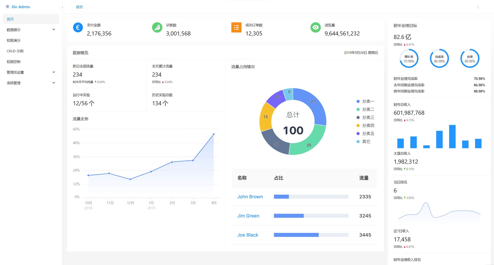

<h1 align="center">Xin Admin</h1>
<h4 align="center">站在巨人的肩膀，优雅的构建你的网站</h4>

    
    
    
    
    
    
    

### ✨ 介绍
基于 ThinkPHP8 + React + TypeScript + UmiJs + Ant Design + Ant Design Pro components 等流行技术栈的后台管理系统，提供权限验证、用户分组、数据字典、可视化CRUD等便捷开发，
遵循Apache License 无需授权即可免费商用.

### 主要特征

#### 🎈 Ant Design 技术栈
基于 Ant Design、 UmiJs 最新技术栈， 强大的前端组件驱动。强大且便捷的权限验证，crud表格，动态菜单，约定式路由等，只需一个 Columns 就可以实现增删改查等表单、表格、查询等功能，以及组件的高度自定义，搭配完善的数据字典系统，轻松的构建你的业务系统。

#### 🎉 PHP 8.1 强力驱动
采用最新的Think PHP 8 + PHP8.1 开发，优先使用 PHP 新特性， 对接口的控制、权限验证和接口验证，只需一个注解即可实现。采用ThinkPHP框架，在保持出色的性能和至简代码的同时，更注重易用性 ，前端新手即可无门槛上手部署系统

#### ✈️ 可视化 CRUD
Pro components 赋予我们极其强大、便捷且易用的 CRUD 开发，编辑字段立即看到表格效果，支持多种组件演示，支持下拉框、单选、多选等。编辑即可看到表单表格以及查询等效果。支持前后端双重数据验证，支持自定义验证。使用MockJs库即可实时查看模拟数据，增强你的CRUD体验，让你把重心放到业务逻辑上，极大的方便了开发者。

#### 📟 权限管理
完善的权限管理体系，页面、菜单、按钮三级权限控制，动态菜单，支持无限父子级权限分组，支持部门权限分派控制，支持数据权限（精细化数据权限控制，控制到行级，列表级，表单字段级，实现不同人看不同数据，不同人对同一个页面操作不同字段

#### ♻️ 数据字典
结合 Antd Pro 建立的 XinDict 组件 ，支持 value、label 映射，支持标签、文字、徽标三种类型，多种显示状态。结合Ant Design Pro 组件，帮助开发者轻松管理和使用数据字典。

### 即将上线
1. 门户设计器，AntdV 图表
2. 数据导入导，报表设计
3. 文章管理 CMS 系统
4. Taro 多端应用
5. APP手机端页面设计器

### 项目愿景
我渴望技术，在这个技术大爆发的时代，通过成熟切优秀的项目，构建出一套稳定、可行性强、方便实用的全栈开发框架，提供多行业跨平台解决方案，包括且不限于 CMS、SaaS、CRM、
BPM等，适用于商城、游戏、即时通信、业务管理、博客等领域。不断探索新环境，结合人工智能，实现 0 代码的同时支持高度自定义，可视化编程，让数字化、信息化方案不再腐败。

### 你的 Star 是我熬夜敲键盘更新文档和代码的动力

### 鸣谢巨人

1.  [Think PHP](https://www.thinkphp.cn/)
2.  [Ant Design](https://ant-design.antgroup.com/index-cn)
3.  等等